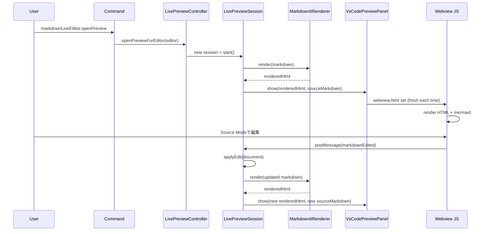

# markdown-live-editor-vs-code

VS Code拡張として動く、Markdownライブプレビューエディターです。

## 特徴

- VS Code拡張として動作
- Markdown編集中にプレビューをリアルタイム更新
- ヘキサゴナルアーキテクチャで責務分離
- `mise`でNode.jsバージョンとタスクを管理
- エディタとプレビューの双方向スクロール同期
- `mermaid`コードブロックの図レンダリング
- `$...$` / `$$...$$` の数式レンダリング（KaTeX）
- VS Codeテーマ（色・フォント）への追従
- VS Codeテーマ種別（light/dark/high contrast）に応じたMermaid配色
- プレビュー上でMarkdown本文を直接編集できるインプレース編集モード
- ライブプレビュー画面内で `Live Preview` / `Source Mode` を切り替え可能

## 技術スタック

- TypeScript
- VS Code Extension API
- markdown-it
- mise

## セットアップ

### 1. miseを有効化

```bash
mise trust mise.toml
```

### 2. 依存関係をインストール

```bash
mise run install
```

### 3. ビルド

```bash
mise run build
```

### 4. 開発ウォッチ

```bash
mise run watch
```

## 実行方法（拡張のデバッグ）

1. VS Codeでこのフォルダを開く
2. `F5`を押して拡張開発ホストを起動
3. Markdownファイルを開く
4. コマンドパレットから `Markdown Live Editor: Open Live Preview` を実行
5. プレビューパネル右上の `Source Mode` でソース編集、`Live Preview` で描画表示へ切り替え

## ヘキサゴナルアーキテクチャ構成

```text
src/
	domain/
		ports/
			MarkdownRendererPort.ts
			PreviewOutputPort.ts
		usecases/
			UpdatePreviewUseCase.ts
	application/
		LivePreviewController.ts
		LivePreviewSession.ts
	adapters/
		primary/
			vscode/
				VsCodePreviewPanel.ts
				VsCodePreviewOutputAdapter.ts
		secondary/
			MarkdownItRenderer.ts
	extension.ts
```

### レイヤーの役割

- `domain`: ユースケースとポート定義（外部依存なし）
- `application`: セッション管理やイベント購読などのオーケストレーション
- `adapters/primary`: VS Code UI（Webview）への出力
- `adapters/secondary`: Markdownレンダリング実装

## 主要コマンド

- `npm run compile`: TypeScriptビルド
- `npm run watch`: 変更監視ビルド
- `npm run package`: VSIXパッケージ作成

## 補足

- 現在はMarkdownドキュメントのみを対象にプレビューを開きます
- 複数ファイルで個別にライブプレビューセッションを持てます

## 簡易化後の実行フロー

以下は、現在の最小構成にした後のメッセージと描画の流れです。



## どこでコケていたか（今回の注釈）

1. 旧実装は経路が多すぎて、表示の実体が追いにくかった
: Toast UI / フォールバック textarea / block editor / Monaco / 初期メッセージキューが同時に存在し、どの UI が有効か一見で判別しづらい状態でした。

2. Live Preview 側が renderedHtml ではなく sourceMarkdown を主に使う経路があり、調査用 class 置換が見えないことがあった
: 「TSで変換したはずなのに preview で見えない」という症状が起きる要因でした。

3. webview.html を初回のみ差し替える設計だと、古い UI が残って調査用表示が現れないことがある
: 現在は毎回 fresh HTML をセットする簡易方式に変更しています。

4. log.json は error 発生時だけ作る実装だと、平常時にファイルが無い
: 現在はセッション開始 info ログでも作成されるようにしています。
