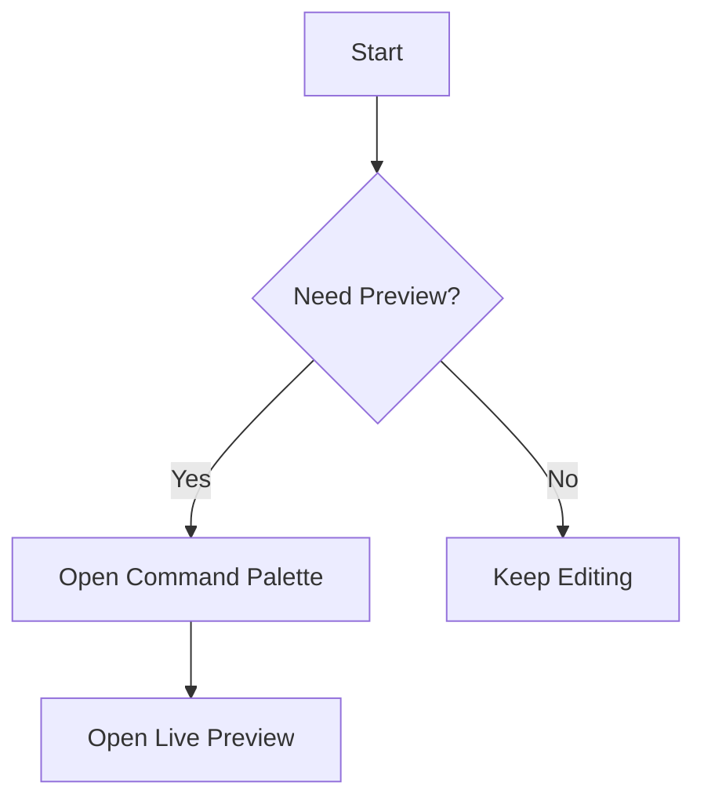

# Markdown Live Editor Try

このファイルは、拡張の動作確認用サンプルです。

## 1. 通常Markdown

- 箇条書き
- **太字**
- [VS Code](https://code.visualstudio.com/)

## 2. Mermaid

## 3. Math Inline

オイラーの等式: $e^{i\pi} + 1 = 0$

## 4. Math Block

$$
\int_0^1 x^2 \, dx = \frac{1}{3}
$$

## 5. Scroll Sync Check

下に長いセクションを置いてスクロール同期を確認します。

### Section A

Lorem ipsum dolor sit amet, consectetur adipiscing elit. Sed do eiusmod tempor incididunt ut labore et dolore magna aliqua.

### Section B

Ut enim ad minim veniam, quis nostrud exercitation ullamco laboris nisi ut aliquip ex ea commodo consequat.

### Section C

Duis aute irure dolor in reprehenderit in voluptate velit esse cillum dolore eu fugiat nulla pariatur.

### Section D

Excepteur sint occaecat cupidatat non proident, sunt in culpa qui officia deserunt mollit anim id est laborum.

### Section E

Vivamus sagittis lacus vel augue laoreet rutrum faucibus dolor auctor. Curabitur blandit tempus porttitor.

### Section F

Integer posuere erat a ante venenatis dapibus posuere velit aliquet. Aenean lacinia bibendum nulla sed consectetur.

### Section G

Maecenas faucibus mollis interdum. Cras justo odio, dapibus ac facilisis in, egestas eget quam.

### Section H

Donec id elit non mi porta gravida at eget metus. Nullam quis risus eget urna mollis ornare vel eu leo.
