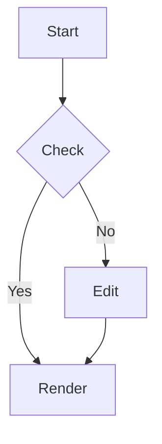

# Markdown Live Editor Test

このファイルは、ライブプレビューとインプレース編集の動作確認用です。

## Basic

- item one
- item two
- item three

> 引用ブロックのテスト

## Task List

- [ ] first task
- [x] done task

## Table

| Name | Value |
| --- | --- |
| alpha | 10 |
| beta | 20 |

## Math

Inline: $a^2 + b^2 = c^2$

Block:

$$
\int_0^1 x^2 dx = \frac{1}{3}
$$

## Mermaid



## Code

```ts
function greet(name: string): string {
  return `hello, ${name}`;
}
```

## Link

- https://example.com
.

# aaa