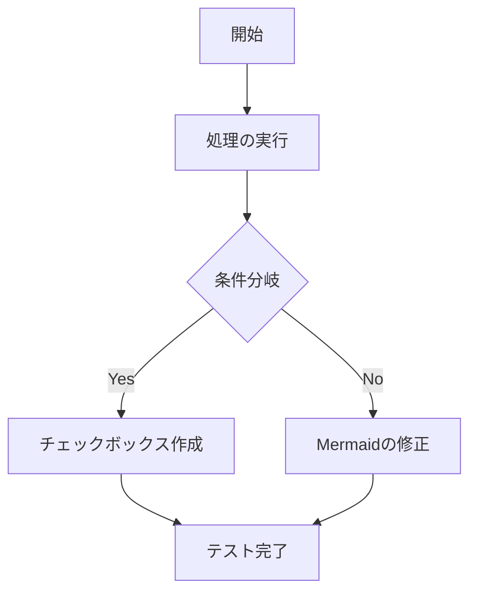

# エディタ機能テスト用ドキュメント

このファイルを使って、追加した「Mermaidの描画」「タスクリスト（チェックボックス）」「Backspaceでのインデント解除」の挙動をテストできます。

- * *

## 1\. タスクリスト（チェックボックス）のテスト

以下のチェックボックスをエディタ上でクリックして切り替えられるか、また新しく `- [ ]` と入力してチェックボックスが生成されるか確認してください。

-   未完了のタスク（クリックしてチェックできるかテスト）
    
-   完了済みのタスク
    
-   ネストされたタスクリストのテスト
    
    -   子要素のタスク1
        
    -   子要素のタスク2
        

- * *

## 2\. Mermaid レンダリングのテスト

以下のコードブロックの下に、白い箱ではなく、綺麗なフローチャート（図）が自動で描画されるか確認してください。テキストを変更した際に、図がリアルタイムに追従すれば大成功です。

